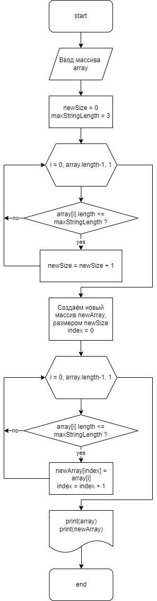

# Итоговая контрольная работа по основному блоку

Написать программу, которая из имеющегося массива строк формирует новый массив из строк, длина которых меньше, либо равна 3 символам. Первоначальный массив можно ввести с клавиатуры, либо задать на старте выполнения алгоритма. При решении не рекомендуется пользоваться коллекциями, лучше обойтись исключительно массивами.

## Описание решения

1. **Главный метод (Main)**: В главном методе программа выполняет следующие действия:
   - Запрашивает у пользователя размер массива с помощью метода `ReadArraySize`.
   - Заполняет массив строк `inputArray` с помощью метода `FillArray`.
   - Выводит на консоль содержимое массива `inputArray` с помощью метода `PrintArray`.
   - Фильтрует массив `inputArray`, чтобы получить новый массив `newArray`, содержащий только строки длиной не более 3 символов, с помощью метода `FilterArray`.
   - Выводит на консоль содержимое массива `newArray` с помощью метода `PrintArray`.

2. **ReadArraySize**: Этот метод считывает с консоли строку, пытается преобразовать ее в целое число `arraySize` и проверяет, что число положительное. Если ввод не является корректным положительным целым числом, программа продолжает запрашивать ввод до тех пор, пока не будет получено корректное значение. Затем метод возвращает полученное число.

3. **FillArray**: Этот метод заполняет массив строк `array` из `size` элементов. Для каждого элемента запрашивается ввод с консоли.

4. **FilterArray**: Этот метод фильтрует исходный массив строк `array` таким образом, чтобы в новом массиве остались только те строки, длина которых меньше или равна заданному `maxStringLength`. Метод сначала определяет размер нового массива `newSize`, затем создает новый массив и копирует в него подходящие строки.

5. **PrintArray**: Этот метод выводит содержимое массива `array` на консоль в виде строки, заключенной в квадратные скобки и разделенной запятыми.

## *Блок схема* программы

